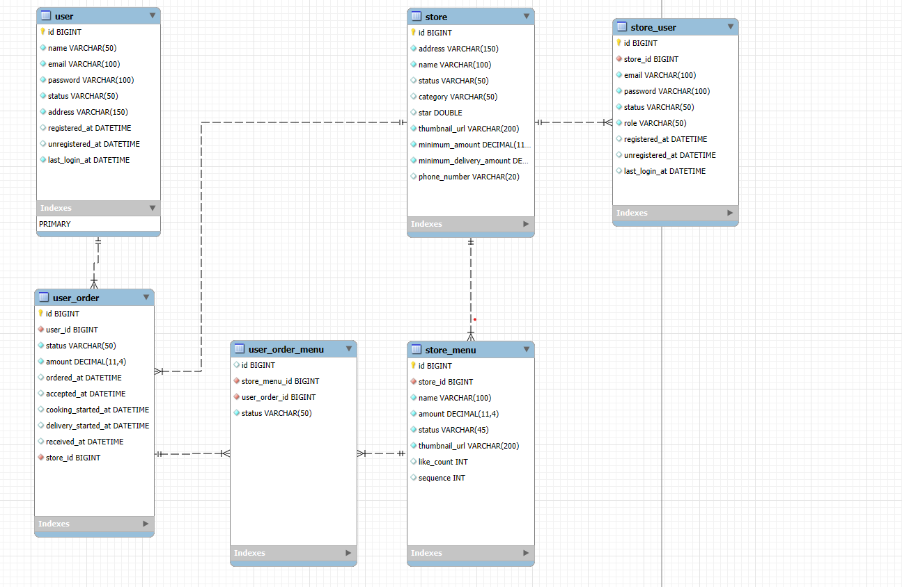

# SSE 강의 부분 다시 보고 그쪽만 코드 수정하기 

# equals and hashCode = 객체비교 할때 사용 
equals와 hashCode를 구현하지 않으면, 객체는 기본적으로 메모리 주소를 기준으로 비교합니다.
즉, new 키워드를 사용해 객체를 생성하면 항상 새로운 메모리 주소가 할당되므로 equals를
사용했을 때도 false가 반환됩니다.하지만 @EqualsAndHashCode 또는 직접 equals와 hashCode를 구현하면,
객체의 필드 값을 기준으로 비교하게 됩니다. 그래서 주소가 달라도 필드 값이 같으면 동일한 객체로 간주되어 equals가 true를 반환

# Parameter 0 of constructor in com.delivery.api.account.AccountApiController required a bean of type 'com.delivery.db.account.AccountRepository' that could not be found.
스프링부트는 자신과 동일한 경로(패키지)에 있는 Bean들을 자신의 Bean으로 등록을 한다 com.delivery.api밑의 있는 bean,autowired,component,service,controller 등 어노테이션이
달려있는것들을 bean으로 등록하게 되어있다 근데 문제점은 com.delivery.db 라는 패키지명이 다르다 그러므로 db에서 bean으로 등록된 AccountRepository를 가져와서
사용할 수 없어서 위에러가 발생한거다

# 해결방안 
1.  com.delivery.db 를 똑같이 com.delivery.api라고 맞춰주면 해결할수 있다 
2.  com.delivery.db 에 하위에 있는 얘들도 bean으로 고려할수 있도록 등록해주는 방법이다 
= 이거는 가져다 사용할 패키지에서 config(여기서는 jpaconfig로 셍성)를 하나 생성하다 거기다가 scan을 작성하면 된다 

# swagger 접속경로
접속경로 http://localhost:8080/swagger-ui/index.html

# shift 두번 누르면 검색(class, method 등) 가능하다

# part2 ch03 은 다시 한번들어서 정리하기 (중요)

# 에러 모음

## swagger 에러
Caused by: java.lang.NoSuchMethodError: 'void org.springframework.web.method.ControllerAdviceBean.<init>(java.lang.Object)'

Fetch error
response status is 500 /v3/api-docs

swagger 버전이 스프링버전에 맞지않아서 발생 

참고
https://blog.everdu.com/558
https://lucas-owner.tistory.com/80

# 더미 데이터
- 회원가입
{
"result": {
"result_code": 0,
"result_message": "string",
"result_description": "string"
},
"body": {
"name": "스티브",
"email": "steave@email.com",
"address": "서울시 강남구",
"password": "1234"
}
}

- 로그인
   "email": "steave@email.com",
    "password": "1234"

- 가게 가입
{
  "result": {
  "result_code": 0,
  "result_message": "string",
  "result_description": "string"
  },
  "body": {
  "name": "스타개미 강남정 ",
  "address": "서울시 강남구",
  "store_category": "COFFEE_TEA",
  "thumbnail_url": "https://i.namu.wiki/i/YMSBcQyJQwDWjAqjhlY_tKIJARbbsAnpzUjwsmjN4rCjAydHO4dZOgfQcngol-7HpbtbzsFovd7N3skC90wr10cUu0kqsbojbq30iH8rarzO3ChnHZHck7yZViAGKtk8LOaboGu_SeTYTTqGdwkzSw.webp",
  "minimum_amount": 6000,
  "minimum_delivery_amount": 3000,
  "phone_number": "024928102"
  }
  }

# RequestParam ,  Requestbody
@RequestBody는 HTTP 요청의 본문(body) 전체를 객체로 받아오고, JSON이나 XML 같은 덩어리 데이터를 처리하는 데 유용합니다. 
반면에, @RequestParam은 URL 쿼리나 폼 데이터를 통해 하나하나의 값을 개별적으로 받아오는 경우에 사용됩니다.

요약
@RequestBody:

데이터 전체를 객체로 변환.

예: {"name": "Alice", "age": 25} 같은 JSON 데이터를 매핑.

@RequestParam:

개별 파라미터를 받아 처리.

예: ?name=Alice&age=25 같은 쿼리 파라미터를 매핑.

# mysql readonly 해제 방법
https://ziszini.tistory.com/120

# list null
//List 타입은 결과가 없을 때 null이 아니라 빈 리스트를 반환합니다.

# erd

# business 어노테이션을 만들지 않고 그냥 business클래스에다가 @Service를 붙여도 된다 

# 가게 유저 등록
{
"storeName": "스타개미 강남정",
"email": "steve@gmail.com",
"password": "1234",
"role": "MASTER"
}

# 에러 
org.springframework.security.authentication.InternalAuthenticationServiceException: No value present 
-> 이게 뜨면 db에 있는 데이터값과 내가 입력한 값이 일치 한지 확인해보기 